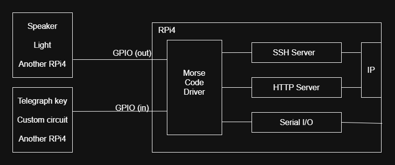
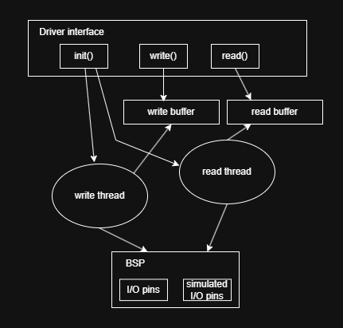

# Overview

The goal of this project is to create a Morse code signal driver. The driver will provide the ability for an application to convert text to Morse code sent out a GPIO pin as a 5V square wave signal. The output could be used as input to a sound generator, a light, or another device using this driver. Similarly, the driver will provide the ability to convert an encoded signal on another GPIO pin as text.

The driver could be used in various applications. A user local to the machine with the driver could be sending and receiving messages in Morse code (via a telegraph key and speaker connected to the I/O pins) to and from a user who is remotely connected via SSH or HTTP. An application could use this driver in conjunction with the Raspberry Pi's on-board UART, which could be useful for someone studying and practicing Morse code. Of course, the output could be sent back to the input on the same or another machine with the same driver (although this application seems limited to testing scenarios).

## Requirements

- Use two GPIO pins of the hardware, one for input and one for output.
- Provide a way to define at least two modes/speeds of operation: one for human speed, one for machine speed.
*- Store up to 20 words received. (Overwrite oldest words when maximum is reached.)
- Words are terminated (delineated) by a space.
- Word size maximum is 20 characters (including ending space).
- Timing will follow the specification of international Morse code as detailed at [morsecode.world](https://morsecode.world/international/timing/).
    - For human mode, suggested unit length is 60ms
    - For machine mode, suggested unit length is 1ms
    - Allow for up to 10% error in timing.
- Acceptable characters include letters (upper and lower cases accepted for sending) and numbers, and spaces which are interpreted as breaks between words.
    - Ignore other characters.
- Accept strings up to 1024 characters for sending.
- Signals received that don't map to letters or numbers will be ignored until a word-end (a low signal for 7 units of time) is detected.

## Design
The diagram below illustrates how the elements of the system will interact. The driver interface simply starts the read and write threads on initialization, and then reads and writes to the buffers as needed. In the background, the read thread is polling the pin (or software simulated pin when not running on hardware) to read the incoming signal and put the associated characters into the read buffer. And the write thread is keeping up with writing the outgoing signal according to what is in the write buffer.

# Target Build System

The Buildroot support for Raspberry Pi 4 will be used.

# Hardware Platform

The target hardware is the Raspberry Pi 4b. Two GPIO pins will be utilized, one as an input, one as an output.

# Open Source Projects Used

Besides the class base repositories, this project will not use any open source projects.

# Previously Discussed Content

This project will make use of the aesdchar driver, with its associated circular buffer, from a previous assignment as a base for this driver.

# New Content

The existing aesdchar driver writes to and reads from a circular buffer. This project will add an additional buffer so that we have one for writing and one for reading. Additionally, this new driver will spawn two kernel threads upon initialization: one for writing from the write buffer to the hardware and one for reading from the hardware to the read buffer. This device will not work for seek(), but will always read the next available yet unread character.

# Shared Material

This project does not use any projects from previous semesters.

# Source Code Organization

All project source code, scripts, configuration files, and documentation will be hosted at [Sara's Final Project Repo](https://github.com/cu-ecen-aeld/final-project-sarakayedwards)

# Schedule Page

The project schedule can be found [here](https://github.com/users/sarakayedwards/projects/2/views/1?visibleFields=%5B"Title","Assignees","Status",352027948,"Linked+pull+requests","Sub-issues+progress"%5D&groupedBy%5BcolumnId%5D=352027948).

